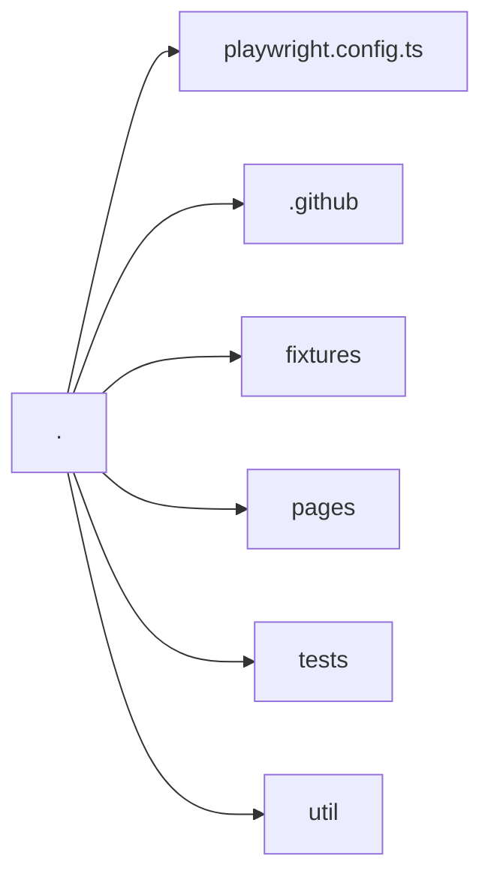

# Datavant Take Home Assessment (Playwright)

This repository is for the Datavant Test Automation takehome assessment. It leverages
Playwright, Typescript and Github Actions.

## Table of Contents

- [Datavant Take Home Assessment (Playwright)](#datavant-take-home-assessment-playwright)
  - [Table of Contents](#table-of-contents)
  - [Setup Instructions](#setup-instructions)
    - [Setup Node.js](#setup-nodejs)
  - [How to run tests](#how-to-run-tests)
    - [Run tests in Github Actions manually](#run-tests-in-github-actions-manually)
  - [How to write new tests](#how-to-write-new-tests)
  - [Test Framework Directory Structure](#test-framework-directory-structure)
    - [playwright.config.ts](#playwrightconfigts)
    - [.github](#github)
    - [fixtures](#fixtures)
    - [pages](#pages)
    - [tests](#tests)
      - [setup](#setup)
    - [util](#util)
  - [Styleguide](#styleguide)
  - [Reporting](#reporting)
  - [Oddities](#oddities)
    - [Calendar Widget](#calendar-widget)
    - [General](#general)
  - [Improvements](#improvements)
  - [Citations](#citations)

## Setup Instructions

### Setup Node.js

- Install nvm (nvm is a node version manager for node.js)

```sh
curl -o- https://raw.githubusercontent.com/nvm-sh/nvm/v0.39.7/install.sh | bash
```

- Restart your terminal or `source` your `.bashrc/.zshrc` to pick up the `nvm` command

- Install the version of node specified in the .nvmrc file by running the below command of the root directory of this repo.

```sh
nvm install
```

- Run the below command and verify your current version of node is `18.19.0`

```sh
node -v
```

- Install the node dependencies and playwright browser drivers (this runs automatically as a postinstall hook).

```sh
npm install
```

- Verify everything was installed correctly by running your first test.

```sh
npm test
```

---

## How to run tests

- Run tests in chromium headless

```sh
npm test # npx playwright test --project=chromium
```

- Run tests in all browsers headless

```sh
npm test:all # npx playwright test
```

- Run tests in chromium with the playwright ui

```sh
npm run test:ui # npx playwright test --project=chromium --ui
```

- Run tests in safari with the browser open

```sh
npx playwright test --project=desktop-safari --headed
```

All CLI options can be found here <https://playwright.dev/docs/test-cli>

### Run tests in Github Actions manually

1. Go to <https://github.com/patrickromo1/datavant-takehome-pw/actions/workflows/playwright.yml>
2. Click the `RUN WORKFLOW` dropdown button.
3. Click the `Run Workflow` button in the pop-up.

## How to write new tests

A common way to write new tests is leverage the code generator which will record all user actions and give fairly respectable locators. It can be triggered against this take home assessment site using the below command.

```sh
npm run codegen # npx playwright codegen https://www.cp.pt/passageiros/en/buy-tickets
```

After getting a basic script that works you can begin refactoring it using page objects and utility functions to have the test conform to your requirements. At this stage it's recommended to use the Playwright UI (similar to Cypress) which allows you to step through your test run, pull new locators and view all your logs, dev console information and source code.

- More info on code generation: <https://playwright.dev/docs/codegen>
- More info on Playwright UI Mode: <https://playwright.dev/docs/test-ui-mode>

---

## Test Framework Directory Structure



### playwright.config.ts

- This config file is used by playwright to configure test runner attributes (e.g. retries, parallel workers, reporters, projects)

### .github

- The github actions workflow file (`.github/workflows/playwright.yml`) is found here. It has 4 stages:

1. Install dependencies
2. Static Code Analysis (Linting, Typechecking and a Dry run of the test suite)
3. Run the tests in all configured browsers
4. Upload test report artifacts
5. Publish html report to Github Pages

### fixtures

Fixtures in playwright allow you to customize how tests run including setup/teardown hooks, class instantiation, annotations for reporting/analytics and advanced logging of test errors.

A basic example is if you want to get run some api calls to get some test data in a certain state for use with 25% of your tests you can run the api calls within the fixture instead of adding the step to 300 tests and any tests that consume the fixture would run these first and not impact tests that do not require this action.

Read more about test fixtures here: <https://playwright.dev/docs/test-fixtures>

### pages

Page objects live in this directory to encapsulate the locators and complex actions for each page for use in end to end tests.

Read more about page objects in playwright here: <https://playwright.dev/docs/pom>

### tests

Tests and setups are store in this directory. The search ticket spec leverages data-driven testing concepts to run the tests against both english and portuguese localizations of the website to ensure the locators use work regardless of language used and avoid having to maintain multiple sets of selectors.

#### setup

Setup files allow you to perform actions to setup the state necessary for your tests. A common usage would be logging into a website then storaging the cookies, local storage etc in a .json file then injecting it before a test runs to re-use the authentication state across all states and not waste time logging into a protected part of a website with each test.

For this test suite it is used to consent to cookies to present a more conventional user path since some parts of the site will not work without consenting to cookies. Tests where you would want to test the user paths without consenting to cookies wouldn't use this setup as a dependency.

Setup dependencies are setup at the project level in the `playwright.config.ts`

```ts
  projects: [
    { name: 'setup', testMatch: /.*\.setup\.ts/ },
    {
      name: 'chromium',
      use: {
        ...devices['Desktop Chrome'], // Use prepared auth state.
        storageState: 'playwright/.auth/cookie-consent.json'
      },
      dependencies: ['setup']
    },
  ]
```

### util

Utility functions that do not leverage aspects of the playwright api are stored here.

---

## Styleguide

This project uses eslint with the standard typescript configuration and an additional playwright specific lint rule plugin.

To run linting, typechecking and playwright dry-run validation identical to what is run in the ci pipeline run the below command.

```sh
npm run check:style
```

To see what all these commands are doing under the hook check them out in the `scripts` portion of the `package.json`.

- Go here to learn more about eslint: <https://eslint.org/>
- Go here to learn about the playwright specific linting rules: <https://github.com/playwright-community/eslint-plugin-playwright?tab=readme-ov-file>

---

## Reporting

The primary report in continuous integration is the playwright html report. Embedded within this report can be screenshots, logs, videos and traces.
Currently the most recent Github Actions run from this repository will publish it at <https://patrickromo1.github.io/datavant-takehome-pw/>. It's possible to spin up the html report with the artifacts locally but it takes some time to download the file and then spin it up it's more user friendly to just upload it as a static site.

## Oddities

The following are observations that were a little "odd" with the site.

### Calendar Widget

- The calendar time is in the Portugal timezone so if you want to book a train for today if will be disabled at midnight Portugal time. This logically makes sense but should be indicated to the end user.
- Today's date is always colored green even when you select a different date this can easily lead to confusion.
- Selecting a date such as January 5th, 2024 then moving to December causes all instances of the `5th` to be highlighted green.
- Typing the date out such as `31 December, 2023` when the site is in Portuguese doesn't work and vice versa. This could be simplified by using 31/12/2023 or other number only variants.
- Manually typing a date out of scope for scheduling (roughly 60 or more days) triggers the input field to glow red but there are no validation error messages displayed to indicate what the problem is. This is the case for all the input fields in both Portuguese and English.
- There are some csp errors for the support chat fonts causing them not to render.

### General

- Options selected are not persisted when switching between Portuguese and English.
- Selecting the `GET` app button that is visible in a top banner in smaller viewports changes the site to Portuguese.

---

## Improvements

From a test automation perspective these are improvements that can be made to the site to improve testibility and make test automation easier.

- The locators for selectable dates in a month are hard to distinguish between 'disabled', 'in-focus' and 'out of focus' dates. Removing the `picker__day--infocus` class from disabled dates would vastly simplify locator scoping but even better would be adding a test data attribute.

- Using the fill command in playwright does not enable the typeahead for station selection. To mitigate this without hacks I used `pressSequentially` which types each character sequentially. A majority of users likely select from the typeahead which is why I opted to use it instead of typing the station directly in the field. This is the case even when entering only a partial station name, many other websites handle this perfectly fine so a nice quality of life improvement would be to change the code so the typeahead will appear even with the automated tests fill command.

- When clicking cancel and returning to the buy tickets page the previous selection is not coming from the server because the state is handled in purely angular. There's are a massive amount of blocking scripts loading in the background before the angular code runs that prefills the previously selected attributes. On slow connections (or fast automated tests) the end user could start re-typing it before it loads up. I mitigated this flakiness in the tests by waiting for the support chat button to appear since it seems to be one of the slowest items to load on the page. It should either be stored in a server side cache or the angular code should run earlier in the page load.

- A lot of element attributes change language when switching to the Portguese version of the site. At some point I made the test run in both variations of the site just so I could feel confident the locators I selected would be compatible in both since a lot of the default selectors from code generated tests use text or placeholder text which all changes.

- There is a language cookie that updates when switching between English and Portuguese but depending on the url route used it totally ignores it. This makes leveraging the locale cookie for test automation impossible because depending on what the initial url used it will overwrite the cookie. I opted to just use a locale parameter in the `goto` page object function but I could have also just set this as an environmental variable (e.g. `PORTUGUESE=1` or `LOCALE=pt`) which is the approach I would take if long term it didn't make sense to run all tests in Portuguese too. It's a nice to have to run all the tests in either language by just injecting an enviromental variable.
- How the site handles disabled attributes is different pretty much in every element across the site. A lot of this is custom disabled logic and playwright doesn't detect the element is disabled which indicates there may be a few accessibility issues with how it's implemented by the devs using non-standard practices.

## Citations

- <https://playwright.dev/>
- <https://playwright.dev/docs/test-configuration>
- <https://playwright.dev/docs/test-cli>
- <https://playwright.dev/docs/emulation>
- <https://playwright.dev/docs/test-global-setup-teardown>
- <https://playwright.dev/docs/test-parameterize>
- <https://playwright.dev/docs/test-reporters>
- <https://playwright.dev/docs/test-ui-mode>
- <https://playwright.dev/docs/codegen>
- <https://playwright.dev/docs/api/class-playwright>
- <https://github.com/playwright-community/eslint-plugin-playwright?tab=readme-ov-file>
- <https://eslint.org/>
- <https://momentjs.com/docs/#/get-set/date/>
- <https://axolo.co/blog/p/part-3-github-pull-request-template>
- <https://docs.github.com/en/actions/using-workflows/manually-running-a-workflow>
- <https://gitlab.com/joaommpalmeiro/diagram-scratchpad/-/blob/master/README.md?ref_type=heads>
- <https://docs.github.com/en/actions/examples/using-concurrency-expressions-and-a-test-matrix>
- <https://docs.github.com/en/actions/using-workflows/storing-workflow-data-as-artifacts>
